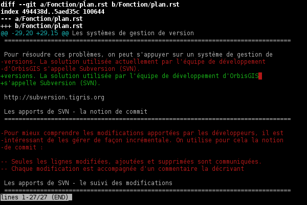

================================================================================
Initiation à la progr - dummy title
================================================================================

Objectifs du cours
--------------------------------------------------------------------------------

- Découvrir les outils permettant de développer avec OrbisGIS
- Aller plus loin dans la connaissance des structures essentielles de GDMS
- Enrichir la couche de gestion des données d'une nouvelle fonction d'analyse

Les outils de développement indispensables
--------------------------------------------------------------------------------

Être capable de développer en équipe.
================================================================================

OrbisGIS est développé et maintenu par des personnes distantes. 

Problèmes : 

- Comment gérer efficacement les modifications apportées dans le code source ?
- Comment savoir qui a fait une modification ?
- Comment assurer la mise en oeuvre de nouvelles fonctionnalités sans mettre
  en péril la base de code existante ?

Les systèmes de gestion de version
================================================================================

Pour résoudre ces problèmes, on peut s'appuyer sur un système de gestion de 
versions. La solution utilisée actuellement par l'équipe de développement
d'OrbisGIS s'appelle Subversion (SVN).

http://subversion.tigris.org

Les apports de SVN - la notion de commit
================================================================================

Pour mieux comprendre les modifications apportées par les développeurs, il est
intéressant de les gérer de façon incrémentale. On utilise pour cela la notion
de commit :

- Seules les lignes modifiées, ajoutées et supprimées sont communiquées.
- Chaque modification est accompagnée d'un commentaire la décrivant

Pour une personne suffisamment investie dans le projet, ces deux informations
sont généralement suffisantes pour :

- Comprendre la teneur du commit
- Apprécier la qualité du code produit
- Éventuellement, apporter des critiques à propos de la modification

Les apports de SVN - la notion de commit : exemple
================================================================================

Les apports de SVN - le suivi des modifications
================================================================================

Quand une modification est prête, le développeur peut la commiter. Cela revient
à publier les changements sur le dépôt SVN. Par conséquent :

- Le commit devient accesible à tous les développeurs du projet
- Le commit est associé par le serveur à son auteur

Les apports de SVN - la notion d'historique (1)
================================================================================

Une modification, une fois commitée, est ajoutée à l'historique du projet. Dans
SVN, l'historique est linéaire : tous les commits sont présentés les uns à la
suite des autres. À chaque commit est associé un numero de *révision*.

Il est possible d'interroger assez finement l'historique d'un dépôt SVN. Ainsi,
nous pouvons :

- Connaître toutes les modifications et tous les messages de chacune des 
  révisions
- Connaître précisément l'historique de chacune des lignes de chacun des 
  fichiers

Les apports de SVN - la notion d'historique (2)
================================================================================

Grâce à l'historique, nous pouvons donc connaître "exactement" :

- L'auteur d'une ligne défectueuse dans le code
- La justification première de l'écriture d'un code, les problèmes qu'il a 
  permis de résoudre.

Ces deux points sont bien sûr contraints :

- À la qualité des messages de commit
- À la qualité de la gestion du dépôt SVN.

Les apports de SVN - la notion d'historique (3)
================================================================================

Grâce à l'historique, on évite parfois les catastrophes. Par exemple, on est 
à l'abri d'une suppression accidentelle de fichiers. On peut toujours requêter
l'historique et retrouver une ancienne version. Du moins tant que le serveur
est vivant...

SVN - quelques commandes de base
================================================================================

- svn checkout : Récupérer une copie locale d'un dépôt distant
- svn diff : Consulter les modifications apportées à la copie locale
- svn commit : Commiter les fichiers sur le serveur
- svn up : Récupérer les modifications poussées sur le serveur par les autres
  développeurs

SVN - conclusion
================================================================================

SVN est un outil qui permet de conserver une vision claire :

- Du travail effectué par tous les développeurs sur un projet
- De l'évolution d'un projet
- De la qualité ponctuelle des modifications apportées à un projet

Les messages de commit constituent également un moyen de communication au sein 
de l'équipe.

Maven - une gestion simplifiée du processus de build
================================================================================

Le second outil indispensable (notamment pour vous en TP) est Maven. Il s'agit
d'un outil permettant de gérer :

- Les dépendances d'un projet.
- Les différentes phases de la construction d'un projet.

Il réalise certaines tâches décrites parfois dans des Makefile (CF ALGPR)

Maven - le paradigme Convention over Configuration (1)
================================================================================

Le principe fondateur de Maven est le suivant : les projets Java respectent
très souvent la même architecture et les mêmes procédures de construction. On va
les définir comme convention pour éviter d'avoir à faire de la configuration 
qui serait :

- Dupliquée
- Fastidieuse

Il reste toutefois possible de personnaliser tous les paramètres de la 
construction du projet.

Maven - le paradigme Convention over Configuration (1)
================================================================================

L'architecture, en particulier, est très codifiée en Java :

- Fichier de configuration à la racine du projet
- Sources placées sous src/main
- Sources de tests placées sous src/test
- Fichiers compilés (.class, .jar...) placés sous target/

Maven - Configuration de l'outil
================================================================================

Maven est configuré au travers du fichier pom.xml, placé à la racine du projet.
On y définit les dépendances du projet, mais également tous les paramètres et
plugins nécessaires à la compilation du projet, à l'exécution des tests... 

Un projet ne vit (presque) jamais seul
================================================================================

Pour pouvoir construire un projet, on a souvent besoin de fonctionnalités
externes.

Exemple : Pour gérer les géométries, nous utilisons une bibliothèque (JTS) 
plutôt que de ré-écrire l'ensemble des codes. Pour construire le projet 
OrbisGIS, nous avons une dépendance envers JTS.

Maven permet de gérer ces dépendances : il va s'occuper de les transmettre
au compilateur, et même parfois à l'exécution. Il construit le "classpath"
nécessaire pour compiler et lancer le logiciel.

Maven - la notion de dépendance
================================================================================

.. image:: heritage.png
         :width: 100%

Maven : Récupération et gestion des dépendances
================================================================================

Pour récupérer et gérer les dépendances du projet, Maven a besoin : 

- De dépôts distants où il pourra les télécharger
- D'un dépôt local où il va les stocker. Ainsi, on évite les téléchargements 
  inutiles.

Quand on lance Maven la première fois, on "télécharge l'Internet"...

Maven - Exemple de dépendance
================================================================================

::

    <dependency>
        <groupId>junit</groupId>
        <artifactId>junit</artifactId>
        <version>3.8.1</version>
        <scope>test</scope>
    </dependency>

- Dépendance à junit
- junit.junit - version 3.8.1
- nécessaire seulement pendant la phase de test

Maven - La gestion des goals
================================================================================

On appelle goal, dans Maven, une phase de la vie d'un projet. Par défaut, 
Maven prévoit plusieurs de ces phases :

- compile : Compilation du projet
- test-compile : Compilation des test du projet
- test : Exécution des tests du projet
- package : Packaging du projet (création du jar)
- install : Installation du package (jar+pom) dans le dépôt Maven local
- deploy : Installation du package (jar+pom) sur un serveur distant

Une phase peut dépendre d'autres phases. Ici, par exemple, chaque phase dépend
de toutes celles présentées avant elle dans la liste.

Maven - conclusion
================================================================================

Maven est un outil qui évite au développeur de perdre son temps sur des tâches
de configuration fastidieuses. Il permet d'aller à l'essentiel (gestion des 
dépendances, des plugins, des goals) et s'occupe de beaucoup de tâches 
chronophages.

Et d'autres outils encore...
================================================================================

Nous n'avons évoqué que deux des outils indispensables à la vie du projet de 
développement OrbisGIS. Il y en a d'autres :

- JUnit : Écriture de tests automatisés, protection contre les bugs
- Hudson/Jenkins : Vérification de l'intégrité du projet
- Sonar : Évaluation de la qualité des codes

GDMS et GDMSQL - de la table à la fonction
--------------------------------------------------------------------------------

Les DataSource dans GDMS
================================================================================

Les données sont gérées, grâce à GDMS, de façon transparente. On utilise le 
concept de *DataSource* quelle que soit la nature de la source de données. Les
*DataSource* présentent les données sous forme de table.

Afin de pouvoir manipuler une *DataSource*, il est nécessaire d'être
capable :

- De savoir quelle est la nature des données présentes dans la table.
- De savoir récupérer les données présentes dans la table.

La structure d'une DataSource
================================================================================

Une DataSource est composée de deux parties indépendantes. On trouve d'une part
les métadonnées réunissant :

- Les types des données, pour chacune des colonnes
- Les contraintes sur les types de données.

On trouve également (fort logiquement) les données dans une source de
données...

Les types de données
================================================================================

Au sein de GDMS, chaque valeur est associée à un type de données. Afin de 
forcer la cohérence entre la nature d'un colonne et son contenu, on associe 
également l'un de ces types aux colonnes, au sein des méta-données. Voyons 
comment sont gérés les types de données, avant de décrire les méta-données.

Dans GDMS, les types sont définis grâce à un champ entier (int), le typeCode. 
Deux valeurs du même type auront le même typeCode (ie leurs typeCode seront 
égaux).

Les types de données alphanumériques
================================================================================

GDMS comporte plusieurs types alpha-numériques selon les définitions suivantes :

::
	
  int BINARY = 1;
  int BOOLEAN = 2;
  int BYTE = 4;
  int DATE = 8;
  int DOUBLE = 16;
  int FLOAT = 32;
  int INT = 64;
  int LONG = 128;
  int SHORT = 256;
  int STRING = 512;
  int TIMESTAMP = 1024;
  int TIME = 2048;

Le type RASTER
================================================================================

Il y a un type dédié pour les données spatiales raster :

::

  int RASTER = 8192;

Les types de données géométriques
================================================================================

Les données géométriques sont gérées finement. Pour chaque type WKT, on a 
un type géométrique dédié :

::

  int GEOMETRY = 4096;
  int POINT = 32768
    | Type.GEOMETRY;
  int LINESTRING = 65536
    | Type.GEOMETRY;
  int POLYGON = 131072
    | Type.GEOMETRY;
  int MULTIPOLYGON = 262144
    | Type.GEOMETRY;

Les types de données géométriques (2)
================================================================================

::

  int MULTILINESTRING = 524288
    | Type.GEOMETRYCOLLECTION;
  int MULTIPOINT = 1048576
    | Type.GEOMETRYCOLLECTION;
  int GEOMETRYCOLLECTION = 2097152
    | Type.GEOMETRY;

Les définitions de ces types sont particulières. On utilise un opérateur bit à
bit sur les entiers pour en modifier la valeur...

Comment sont construits les types géométriques ?
================================================================================

L'opérateur "|" peut être considérer comme un "ou logique". Si on l'applique sur
deux entiers, il va mettre à 1 les bits de l'entier résultant pour lesquels le 
bit correspondant est mis à un dans au moins un des deux entiers d'entrée.

Comment sont construits les types géométriques ? (2)
================================================================================

Concrètement...

::

  0001100111
  |
  1001010011
  -========- 
  1001110111

Pour une puissance de deux, nous sommes sûrs qu'il n'y a qu'un seul bit à 1.
On est sûr qu'il n'y aura pas de superposition entre les bits des puissances de 
deux. Par conséquent, tous les type géométriques héritent du bit de 4096. Les
collections de géométries possèdent également le bit de 2097152.

Comment tester les types géométriques ?
================================================================================

Comme il n'y a pas de superposition entre les bits lors de la construction des 
types, on ne perd pas d'informations, et on peut tester ces types.

Pour les types autres que GEOMETRY et GEOMETRYCOLLECTION, on fait un test
d'égalité (==).

Pour les types GEOMETRY et GEOMETRYCOLLECTION, on utilise l'opérateur bit à bit
&. Il s'agit du "et logique" sur les bits.  

Le & binaire concrètement
================================================================================

::

  0001100111
  &
  1001010011
  -========- 
  0001000011

Comment tester les types géométriques ?
================================================================================

Pour tester qu'un type est compatible avec Type.GEOMETRY, on fera

::
  
  (monType.getTypeCode() & 
    Type.GEOMETRY) != 0

Pour le type Type.GEOMETRYCOLLECTION :

::
  
  (monType.getTypeCode() &
    Type.GEOMETRYCOLLECTION) != 0

Le type NULL
================================================================================

Il existe un type NULL, dans GDMS, accessible grâce au champ 

::

  Type.NULL

Ce champ est compatible avec tous les autres types de données. On pourra donc 
mettre une valeur de Type Type.NULL dans n'importe quelle colonne (sauf
contrainte contraire). On ne pourra par contre pas mettre autre chose que 
des données de Type Type.NULL dans une colonne de Type Type.NULL.

Les contraintes sur les types de données
================================================================================

Afin de forcer les données à respecter certains critères, on peut ajouter des
contraintes sur les types de données. On s'en servira lors de chaque ajout dans
une colonne. Pour que l'ajout soit possible, il faut que :

- Le type de la donnée soit compatible avec le type de la colonne
- La donnée respecte toutes les contraintes placées sur le type de la colonne

Quelles contraintes peut-on utiliser ?
================================================================================

Cela dépend bien entendu du type... Pour un type INT, par exemple :

- Valeur minimum
- Valeur maximum

Pour un champ géométrique : 

- Dimension des points de l'objet (2D ou 3D) : certaines fonctions ont besoin 
  de points définis avec trois dimensions.
- Nature de l'objet : ponctuel, linéaire, surfacique.

Comment manipuler les contraintes d'un type ? 
================================================================================

Les contraintes sont ajoutées à la construction du type. On passe pour cela en
paramètre un tableau de contraintes au constructeur du type.

Pour connaître les contraintes placées sur un type, on pourra :

- Récupérer le tableau entier de contraintes
- Récupérer directement une contrainte (générique) du tableau

Exemple de type créé avec une contrainte
================================================================================

En BeanShell :

::
  
  import org.gdms.data.types.Type;
  import org.gdms.data.types.TypeFactory;
  import org.gdms.data.types.
    GeometryDimensionConstraint;

  //On veut des objets ponctuels
  GeometryDimensionConstraint gdc = 
    new GeometryDimensionConstraint(0);

  Type geom = TypeFactory.
    createType(Type.GEOMETRY, gdc);
  print("success");

Les métadonnées
================================================================================

Les métadonnées sont les structures qui nous servent à décrire les tables dans 
GDMS. Elles permettent d'identifier chacune des colonnes de la table. Pour cela,
Elles sont constituées : 

- D'une liste de String : Les noms des champs
- D'une liste de Type

On utilise à l'instanciation deux tableaux (un de String, un de Type). Ils 
DOIVENT faire la même taille. Sinon, une exception est levée

Passée l'instanciation, on manipule des champs : on ne peut pas ajouter ou 
supprimer une entrée dans la liste de Type sans supprimer l'entrée 
correspondante dans la liste de String.

Créer et manipuler une métadonnée
================================================================================

On utilisera la classe DefaultMetadata. On peut :

- Créer une métadonnée vide
- Créer une métadonnée à partir de deux tableaux : un de String et un de Type
- Créer une métadonnée en copiant une métadonnée existante.

Les manipulations sur les champs sont faites directement depuis les méthodes
de la classe. Certaines opérations (recherche de champs géométriques, de clés
primaires, recherche d'un champ spatial...) peuvent être effectuées grâce à
la classe MetadataUtilities.

Création d'une métadonnée
================================================================================

Pour créer une métadonnée, on pourra procéder de la façon suivante :

::

  Type geom = TypeFactory.
         createType(Type.GEOMETRY);
  String f1 = "the_geom";
  Type ent = TypeFactory.
         createType(Type.INT);
  String f2 = "numb";
  Type[] arg0 = new Type[] 
         {geom, ent};
  String[] arg1 = new String[] 
         {f1,f2};
  Metadata md = 
      new DefaultMetadata(arg0, arg1);
  print("success");

Pour ajouter un champ...
================================================================================

::
 
  md = new DefaultMetadata();
  Type geom = TypeFactory.createType(Type.GEOMETRY);
  String f1 = "the_geom";
  md.addField(f1, geom);
  print("success");

Analyser la structure d'un champ
================================================================================

::

  md.getFieldCount();
  md.getFieldName(1);
  md.getFieldType(1).getTypeCode();

Gérer les géométries dans GDMS
================================================================================

La gestion des objets géométriques dans GDMS est réalisée par le biais d'une
bibliothèque externe : JTS (JTS Topology Suite). Elle fait référence dans le
monde de Java, et a été portée dans d'autres langages (comme JavaScript ou C.
PostGIS utilise GEOS, le portage de JTS en C).

Pourquoi JTS :

- Développement actif
- Réactivité du développeur
- Reconnaissance très forte (Récompensée plusieurs fois à FOSS4G)
- Très bonnes performances

Les types Géométriques de JTS (1)
================================================================================

JTS a été conçu de façon a être compatible avec la SFS (Simple Feature SQL). Par
conséquent, on va retrouver les mêmes types géométriques que dans GDMS (que 
c'est beau le hasard) :

- Point et MultiPoint
- LineString et MultiLineString
- Polygon et MultiPolygon
- Geometry et GeometryCollection

Reste à instancier ces objets...

Les types Géométriques de JTS (2)
================================================================================

Quelques notions sont essentielles pour utiliser JTS :

- Les géométries sont constituées de coordonnées, instances de Coordinate.
- On crée une LineString à partir d'un tableau de coordonnées
- On crée un polygon à partir d'une instance de LinearRing (l'enveloppe) et 
  d'un tableau de LinearRing (les trous)

Le concept de Factory
================================================================================

Dans certaines bibliothèques, on est parfois amené à manipuler des objets qui :

- sont très proches par nature
- présentent des processus de manipulation et de création similaires

Pour simplifier la gestion de ces objets, on utilise une *Factory*, c'est à 
dire une classe dédiée à l'instanciation d'autre objets ayant un ancêtre commun.

On utilise les mécanismes de surcharge de Java : 

- On peut avoir, dans une même classe, deux méthodes ayant le même nom si elles
  ont des paramètres différents
- Deux méthodes au même nom peuvent avoir un type de retour différent

La classe GeometryFactory
================================================================================

Dans JTS, le moyen le plus courant d'instancier les géométries est d'utiliser
la classe GeometryFactory. Par exemple, pour créer une instance de point :

::
  
  GeometryFactory gf = new GeometryFactory();
  Coordinate c = new Coordinate(1,1);
  Point p = gf.createPoint(c);

Toutes ces classes sont présentes dans le package :

::

  com.vividsolutions.jts.geom

Les opérations possibles grâce à JTS...
================================================================================

JTS met à notre disposition un très grand nombre de fonctions topologiques :
intersection, union, différence... La documentation complète est disponible à
l'adresse :

http://tsusiatsoftware.net/jts/javadoc/index.html

Un exemple d'opération : l'intersection.
================================================================================

On peut calculer l'intersection entre deux polygones :

::
  
  GeometryFactory gf = new GeometryFactory();
  Coordinate c1 = new Coordinate(1,1);
  Coordinate c2 = new Coordinate(1,3);
  Coordinate c3 = new Coordinate(3,3);
  Coordinate c4 = new Coordinate(3,1);
  Coordinate[] cs =
    new Coordinate[] {c1, c2, c3, c4, c1};
  LinearRing lr = gf.createLinearRing(cs);
  Polygon p1 = gf.createPolygon(lr, 
    new LinearRing[]{});

Un exemple d'opération : l'intersection.
================================================================================

::

  Coordinate c12 = new Coordinate(0,0);
  Coordinate c22 = new Coordinate(0,2);
  Coordinate c32 = new Coordinate(2,2);
  Coordinate c42 = new Coordinate(2,0);
  Coordinate[] cs2 = 
     new Coordinate[] {c12, c22, c32, c42, c12};
  LinearRing lr2 = gf.createLinearRing(cs2);
  Polygon p12 = gf.createPolygon(lr2, null);
  Geometry ge = p12.intersection(p1);
  print(ge);

Les données - les Value
================================================================================

Jusqu'à présent, nous n'avons que décrit les données, sans expliquer comment 
elles sont manipulées. Nous utilisons pour cela l'interface Value. Une Value
embarque une donnée en la décrivant avec un type.

- Pour récupérer le type : getType()
- Pour récupérer la valeur : getAs **Type** ()

On récupère le type directement sous sa forme entière.

Les données - les Value
================================================================================

Certaines opérations (mathématiques, logiques, mais aussi les getters...) sont 
disponibles pour toutes les valeurs. Elles ne sont cependant pas toujours 
implémentées. On ne peut en effet pas :

- Additionner deux géométries.
- Représenter une géométrie sous forme de date.
- Faire un ou logique sur des chaînes de caractère.

La présence de ces méthodes dans toutes les interfaces permet de gagner du
temps lors de l'écriture des codes. La rigueur est de mise : en cas 
d'incohérence, une exception sera levée

Les données - la classe ValueFactory
================================================================================

La classe ValueFactory est, comme son nom l'indique, une Factory dédiée à la 
création d'instances de Value. Par exemple :

Pour créer une PointValue (si pt est un point) :

::
  
  PointValue pv = 
    ValueFactory.createValue(pt)

Pour créer une StringValue : 

::

  StringValue sv =
    StringValue.createValue("bonjour");

Valider une Value avec une contrainte
================================================================================

On peut utiliser une instance de Constraint pour valider une instance de Value :

::

  Polygon p1 = gf.createPolygon(lr, 
    new LinearRing[]{});
  Coordinate cp = new Coordinate(1,1); 
  Point point = gf.createPoint(cp);
  GeometryDimensionConstraint gd = 
  new GeometryDimensionConstraint(0);
  Value v1 = ValueFactory.createValue(p1);
  Value v2 = ValueFactory.createValue(point);
  print(gd.check(v2));
  print(gd.check(v1));

Et enfin... les DataSource
================================================================================

Maintenant que nous avons réussi à :

- Décrire les données
- Construire et manipuler les données

nous sommes presque capables de gérer une source de données.

Accéder à une DataSource
================================================================================

Une source de données peut être ouverte ou fermée. La plupart des opérations ne
peuvent être réalisées que sur une DataSource ouverte. Pour ouvrir une 
DataSource, on utilise la méthode open().

Une fois les manipulations terminées, il est important de fermer la source de 
données. Cela permet de libérer les ressources, et de permettre à d'autres
codes d'accéder à la donnée. Pour cela, on appelle la méthode close().

Récupérer une donnée dans une DataSource
================================================================================

Une DataSource est consituée de métadonnées, et de lignes de valeurs. On 
peut également connaître :

- le nombre de lignes contenues dans la DataSource avec getRowCount()
- Le contenu d'une ligne avec getRow(long i), qui renvoie un tableau de Value[]
- La Value (générique) avec getFieldValue(long rowIndex, int fieldId);

Ajouter une donnée à une DataSource
================================================================================

On n'ajoute pas vraiment une donnée à une DataSource. On ajoute plutôt une ligne
de données, ou plus précisément un tableau de Values. Il doit correspondre en
taille et en types avec les métadonnées de la table.

- Pour ajouter une ligne à la fin : insertFilledRow(Value[] values)
- Pour ajouter une ligne à un indice donné : insertFilledRowAt(long index, 
  Value[] values)

On dispose également de nombreux setters pour modifier la valeur d'une cellule
existante du tableau.

Créer une DataSource
================================================================================

Là encore, le moyen le plus commun pour créer une DataSource est d'utiliser
la factory dédiée : **DataSourceFactory**. Ici encore le fait de passer par une
factory présente des avantages :

- Pas besoin de connaître l'API des pilotes
- Appel transparent quel que soit le fichier

Il existe des raccourcis pour créer une DataSource (SourceManager, 
DataManager).

Création d'une DataSource
================================================================================

::

  MapContext mc = mc;
  DataManager dm = 
    Services.getService(DataManager.class);
  DataSourceFactory dsf = 
    dm.getDataSourceFactory();
  File f = new File("/home/alexis/Documents/"
    + "DataS8/Data_lab_OrbisGIS_1/Vecteur/"
    + "DEP_FRANCE.shp");
  DataSource ds = dsf.getDataSource(f);
  ds.open();
  print(ds.getAsString());
  ILayer layer = dm.createLayer(ds);
  mc.getLayerModel().addLayer(layer);

Récupération des données
================================================================================

Ligne entière :

::

  Value[] vals = ds.getRow(0);
  print(vals.get(2));

Valeur seule :

::

  Value val = ds.getFieldValu(0,2);
  print(val);

Ou, si on veut récupérer le contenu de la Value :

::

  Value val = ds.getString(0,2);
  print(val);

DataManager et SourceManager - La gestion des sources
================================================================================

Au sein du logiciel, afin d'harmoniser la gestion des sources de données, trois
classes ne sont instanciées qu'une fois.

- Le DataManager va gérer toutes les sources déclarées dans le logiciel,
  temporaires ou non.
- On a une seule instance de DataSourceFactory, utilisable partout dans le 
  logiciel. Cette instance est liée au DataManager
- On a une seule instance de SourceManager, qui gère toutes les sources de 
  données permanentes. Elle est liée au DataSourceFactory.

Petit bilan...
================================================================================

À ce stade, nous sommes capables de :

- Créer un Type
- Placer des contraintes sur un type
- Créer des valeurs alpha-numériques
- Créer des valeurs géométriques
- Manipuler les géométries avec JTS
- Manipuler des sources de données

Nous avons donc toutes les cartes en main pour créer nos propres fonctions
SQL

Création de fonction dans GDMSQL
--------------------------------------------------------------------------------

Préambule...
================================================================================

Nous atteignons un stade où il n'est plus possible de remplir nos objectifs à
l'aide du BeanShell. Nous allons installer un nouvel outil Netbeans, afin
de pouvoir utiliser Maven et SVN. L'installation se fera sous Linux, pour 
des raisons pratiques...

GDMSQL, une couche extensible
================================================================================

On peut distinguer deux parties dans GDMSQL : 

- L'interpréteur du langage.
- Les fonctions métiers.

Si l'interpréteur n'est a priori pas destiné à subir des modifications 
extérieures, les fonctions peuvent être enrichies de nouvelles procédures. On 
distingue trois types de fonctions :

- Les fonctions scalaires, avec plus précisément :

  - Les fonctions aggrégées
  - Les fonctions non aggrégées

- Les fonctions tables
- Les fonctions "executor"

Les fonctions scalaires
================================================================================

Une fonction scalaire renvoie une valeur scalaire (ie une simple Value, dans
notre cas). 

- Les fonctions aggrégées produisent un résultat basé sur l'analyse d'une 
  colonne. Ex : COUNT, MAX, AVG...
- Les fonctions non aggrégées produisent un résultat basé sur une ou plusieurs
  valeurs d'une ligne (COS, ROUND...)

Les fonctions tables
================================================================================

Une fonction table produit une table de données, représentée comme une 
DataSource, en se basant sur les informations présentes dans les champs données
en paramètre.

Exemple : ST_Explode, ST_SplitLine

Les fonctions executor
================================================================================

Les fonctions "executor" permettent de réaliser des opérations ailleurs que sur
les données (sur l'UI, par exemple). Elles sont appelées grâce à l'instruction
SQL 

::

  EXECUTE

et permettent, par exemple :

- d'ajouter une couche au MapContext depuis un appel SQL.
- de zoomer sur une zone précise d'une carte.

La gestion des fonctions dans GDMSQL
================================================================================

Il est possible d'ajouter des fonctions à GDMSQL, par le biais de la classe
FunctionManager. Elle permet d'ajouter et de supprimer statiquement des
fonctions SQL lors de l'exécution du logiciel.

Lors de l'exécution d'un script SQL contenant une fonction, GDMSQL interroge
cette classe. Il peut alors instancier la ou les fonctions nécessaire, et enfin
exécuter le script désiré.

Création d'une fonction scalaire
================================================================================

La première fonction que nous allons créer sera scalaire. Elle nous permettra
de calculer la densité d'une propriété dans un polygone. Nous l'appellerons
ST_Density.

Pour créer une fonction scalaire, nous allons devoir créer une nouvelle classe.
On va la placer dans un package dédié à nos travaux :

::

  package org.gdms.sql.function.shuit;

  public class ST_Density {

  }

Implémentation de ScalarFunction
================================================================================

Les fonctions scalaires implémentent toutes l'interface ScalarFunction. On ne va 
pas l'implémenter directement : certaines méthodes sont communes à toutes les
fonctions scalaires et sont déjà décrites dans la classe abstraite
AbstractScalarFunction :

- isAggregate() -> false
- isScalar() -> true
- isTable() -> false
- isExecutor -> false

Rien de surprenant, donc...

Héritage de AbstractScalarFunction
================================================================================

Nous héritons donc directement de AbstractScalarFunction :

::

  package org.gdms.sql.function.shuit;
  import org.gdms.sql.function.
      AbstractScalarFunction;
  public class ST_Density 
      extends AbstractScalarFunction{}

Ce qu'il nous reste à faire
================================================================================

À ce stade, nous ne sommes pas capable de compiler notre fonction. En effet,
certaines méthodes imposées par l'interface ScalarFunction ne sont pas
implémentées ! Ces méthodes sont :

- getType
- getDescription
- getFunctionSignatures
- getName
- getSqlOrder
- evaluate

Description des méthodes : getType
================================================================================

getType permet de spécifier le type de la valeur de retour de notre fonction
scalaire, en fonction des types des valeurs en entrée. Dans notre cas, nous
allons renvoyer un double, la méthode devient donc :

::

  public Type getType(Type[] argsTypes) {
    return TypeFactory.createType(Type.DOUBLE);
  }

Nous avons besoin d'importer les classes :

::

  org.gdms.data.types.Type
  org.gdms.data.types.TypeFactory

Description des méthodes : getDescription
================================================================================

Cette méthode permet de donner une description textuelle de la fonction. Elle
ernvoie la description sous forme de chaîne de caractères :

::

  public String getDescription() {
    return "Compute a density";
  }

Description des méthodes : getFunctionSignatures
================================================================================

Cette méthode renvoie les signatures autorisées pour appeler la fonction. On
appelle signature un ensemble de types tels que des valeurs respectant ces types
pourront être utilisées comme paramètre de la fonction. Dans notre cas, nous
avons besoin d'une géométrie et d'un numérique comme arguments de notre 
fonction. La signature précise également le type de retour de la fonction.

Pour créer une signature, nous avons besoin de plusieurs choses :

- Le type de retour (avec getType)
- Un instance de ScalarArgument pour chacun de nos arguments.

La classe ScalarArgument
================================================================================

ScalarArgument est utilisé par le moteur d'exécution SQL pour valider les appels
faits aux fonctions SQL. Les différents types possibles sont définis directement
dans ScalarArgument. Dans notre cas, nous avons besoin de :

- ScalarArgument.GEOMETRY
- ScalarArgument.INT

La construction de notre signature se fait donc comme suit :

::

  new BasicFunctionSignature(
    getType(null),
    ScalarArgument.GEOMETRY, 
    ScalarArgument.INT)

Implémentation de getFunctionSignatures
================================================================================

La méthode getFunctionSignatures peut donc être implémentée de la façon
suivante :

::

  public FunctionSignature[] 
  getFunctionSignatures() {
    return new FunctionSignature[]{
    new BasicFunctionSignature(
        getType(null),
        ScalarArgument.GEOMETRY, 
        ScalarArgument.INT)
    };
  }

Description des méthodes - getName
================================================================================

getName renvoie une chaîne de caractère, qui correspond au nom de la fonction
tel qu'il sera appelé dans les scripts SQL.

::

  public String getName() {
    return "ST_Density";

Description des méthodes - getSqlOrder
================================================================================

Cette méthode renvoie un exemple (simple) d'utilisation de la fonction en SQL.
Nous pouvons donc l'implémenter comme suit :

::

  public String getSqlOrder() {
    return "select ST_Density(the_geom,i)"
      +" from table;";
  }

Description des méthodes - evaluate
================================================================================

Cette méthode réunit l'intelligence de la fonction. C'est ici que sont
récupérées les valeurs d'entrée, qu'elles sont traitées, et que la valeur de
retour est renvoyée.

Le moteur SQL se charge, en amont, de :

- valider le nombre d'arguments.
- valider le type du ou des arguments.

Le moteur SQL vérifie en aval que la valeur renvoyée est bien du type attendu.

Les arguments de evaluate
================================================================================

La définition (signature) de evaluate est la suivante :

::

  public Value evaluate(
      SQLDataSourceFactory dsf, 
      Value... args) 
    throws FunctionException

Nous avons donc à disposition :

- Un DataSourceFactory pour, éventuellement, manipuler des DataSource
- Un tableau de valeurs (args)

En cas de problèmes, nous sommes invités à émettre une FunctionException.

Implémentation de evaluate (1)
================================================================================

Nous allons devoir calculer l'aire d'une géométrie. Pour cela, nous devons :

- Récupérer la géométrie
- L'identifier comme un polygone ou un multipolygon
- Récupérer son aire.

On va créer une méthode dédiée

Calcul de l'aire de la géométrie
================================================================================

::

  private double getGeometryArea(
      Geometry geom){
    if(geom instanceof Polygon){
      Polygon poly = (Polygon) geom;
      return poly.getArea();
    } else if(geom 
       instanceof MultiPolygon){
      MultiPolygon poly = 
         (MultiPolygon) geom;
      return poly.getArea();
    } else {
      return 0;
    }
  }

Implémentation de evaluate(2) 
================================================================================

L'implémentation de evaluate devient donc :

::

  public Value evaluate(
       SQLDataSourceFactory dsf, 
       Value... args) 
     throws FunctionException {
   double area = getGeometryArea(
       args[0].getAsGeometry());
   int i = args[1].getAsInt();
   return ValueFactory.createValue(area/i);
  }

Déclaration de la fonction de le FunctionManager
================================================================================

Notre fonction est désormais complète, prête à être exécutée. Nous devons
l'ajouter au FunctionManager afin de pouvoir l'utiliser depuis le logiciel.
Nous ajoutons donc la ligne

::

  addFunction(ST_Density.class);

dans le bloc statique de FunctionManager. Une fois fait, on recompile nos
bibliothèques, on lance le logiciel... et on peut utiliser la fonction !

