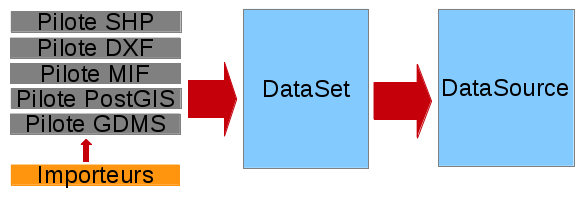
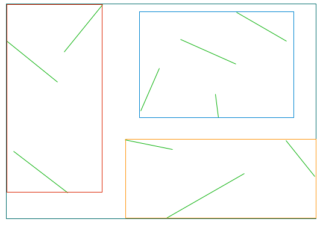
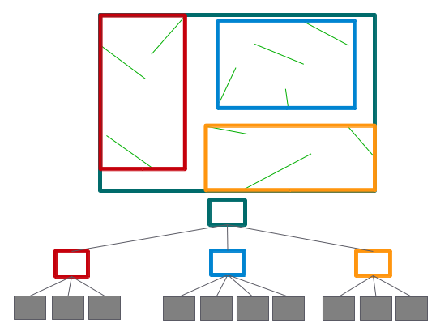
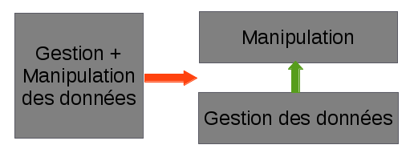

--------------------------------------------------------------------------------
Initiation à la progr - dummy title
--------------------------------------------------------------------------------

Objectifs du cours
================================================================================

Objectifs du cours : 

- Présenter certains principes essentiels en informatique appliquée à la
  géographie.
- Découvrir et manipuler les interfaces de programmation d'OrbisGIS.

OrbisGIS- Principes de fonctionnement
================================================================================

OrbisGIS est un logiciel SIG composé de plusieurs couches :

* La couche de gestion des données
* Le langage de manipulation des données
* La gestion des couches géographiques
* L'interface graphique

Les briques sont définies aussi indépendamment que possible, afin de simplifier
la maintenance du logiciel dans son ensemble

La couche de gestion des données : GDMS
================================================================================

Une gestion unifiée des sources de données (1)
--------------------------------------------------------------------------------

GDMS : Generic Datasource Management System. C'est la couche de gestion des 
données dans OrbisGIS.

Objectif : Assurer la transparence des opérations de manipulation des données,
qu'elles soient géospatiales ou juste alpha-numériques.

Pour GDMS, tout est DataSource

Une gestion unifiée des sources de données (2)
--------------------------------------------------------------------------------

Utilisation de la notion de pilotes et d'importeurs (en construction) :

Concrètement, ça marche ?
--------------------------------------------------------------------------------

Plusieurs formats de données sont gérés par les pilotes :

* Des formats de fichiers : SHP, GDMS, MIF/MID, DXF...
* Les bases de données spatiales  : PostGIS, H2Spatial...

Des importeurs commencent à faire leur apparition (GPX)

Pourquoi ne pas faire que du PostGIS ?
--------------------------------------------------------------------------------

Les fichiers plats présentent certains avantages :

- Facilité d'échange
- Légèreté des manipulations
- Pas besoin d'accéder à une base de données

Les fichiers plats présentent des faiblesses :

- Pas de schéma
- Pas de relations entre les tables.
- Pas de vérification d'intégrité référentielle (clefs étrangères)
- Dispersion de la connaissance

Concrètement, une source de données, c'est quoi ?
--------------------------------------------------------------------------------

GDMS gère des tables de données. Une table est constituée :

- De métadonnées décrivant les types et contraintes sur les types qui 
  constituent la table
- De données, contenues dans les lignes de la table

Les métadonnées permettent :

* De vérifier qu'une opération peut être effectuée sur
  une table : on ne peut pas calculer l'aire d'une chaîne de caractères, 
  par exemple.
* De contrôler les données qui sont ajoutées à une table. On ne peut pas 
  insérer une géométrie dans un champ numérique.

Pourquoi un format de données spécifique à OrbisGIS ?
--------------------------------------------------------------------------------

Beaucoup de SIG libres ne proposent pas leur propre format de données. Ils 
manipulent plutôt des formats existants.

Le format GDMS natif présente des avantages :

* Rapidité d'accès aux données
* Gestion des données spatiales et alphanumériques dans un seul fichier
* Accès bufferisés aux données
* Gestion de fichiers de grande tailles 
* Format ouvert

La principale faiblesse du format GDMS : le manque de documentation... :-(

Gestion des données, gestion des indexes
--------------------------------------------------------------------------------

GDMS est capable de gérer des fichiers de plusieurs dizaines de Go.

Problème : Comment trouver une donnée rapidement ?

Plus précisément :

- Comment trouver rapidement tous les enregistrements dont la valeur du
  champ "ALTITUDE" est 5 ?
- Comment trouver toutes les géométries présentes dans une zone données ?

Solution : Mettre en place des indexes

Les indexes alpha-numériques (1)
--------------------------------------------------------------------------------

Les types numériques et litéraux possèdent un point commun : on peut les 
ordonner "naturellement" :

- Pour les chaînes de caractères : Ordre lexicographique
- Pour les champs numériques : relation d'ordre pour les réel (ou les entiers
  selon les cas, mais la différence n'est pas fondamentale).

On est capable de trier les valeurs. Reste à les placer dans la structure de
données la plus adaptée.

Les indexes alpha-numériques (2)
--------------------------------------------------------------------------------

Quelle structure de données sur le disque ?

Première approche : Simple table clé-valeur (valeur cherchée, position dans le 
fichier) et recherche par dichotomie : nombreuses opération d'entrée-sortie,
coût élevé.

.. image:: dichotomie.png
  :width: 75%

Les indexes alpha-numériques (3)
--------------------------------------------------------------------------------

Utilisation d'un arbre de recherche équilibré (B+Tree) : Recherche dans une 
seule direction dans l'index.

.. image:: btree.png
  :width: 75%

Les indexes alpha-numériques (4)
--------------------------------------------------------------------------------

Avantages d'un arbre équilibré : 

- Profondeur constante -> On accède aux données dans le même temps quelle que 
  soit la donnée
- Recherche (sur disque) des données peut être faite en lisant toujours dans
  le même sens

.. image:: btreeOnFile.png
  :width: 75%

Les indexes spatiaux (1)
--------------------------------------------------------------------------------

Pour les données spatiales, on n'a pas de relation d'ordre simple. Mais on a 
tout de même besoin de trouver les données rapidement...

Stratégie : partitonnement de l'espace. On analyse la configuration spatiale des
données, et on construit un arbre reflétant l'organisation spatiale du jeu de 
données...

Les indexes spatiaux (2)
--------------------------------------------------------------------------------

On partitionne l'espace...

Les indexes spatiaux (3)
--------------------------------------------------------------------------------

...et on en déduit un arbre de type BTree.

Une implémentation intégrée du langage SQL.
================================================================================

La couche de manipulation des données
--------------------------------------------------------------------------------

GDMS est la couche de manipulation des données. Elle permet de :

- Lire les données
- Écrire les données
- Gérer les sources de données
- Décrire les données

Les autres manipulations ne sont a priori pas prévues. GDMS embarque un moteur
SQL pour pallier cette faiblesse.

Une implémentation SQL avec fonctions spatiales.
--------------------------------------------------------------------------------

Le SQL est le langage de référence pour la manipulation des données dans 
OrbisGIS.

Avantages : 

- Langage connu des géomaticiens.
- Langage "proche" du langage naturel.

Inconvénients :

- Pas procédural
- Pas de variables

Concrètement...
--------------------------------------------------------------------------------

C'est (presque) ce que vous avez utilisé en TP. Il s'agit de la nouvelle version
du langage de manipulation des données inclus dans OrbisGIS.

Séparation de la gestion et de la manipulation-> possibilité de changer le 
langage de manipulation sans altérer la gestion des données.

Ce que contient le moteur SQL.
--------------------------------------------------------------------------------

Il est constitué de plusieurs parties :

- Un moteur d'interprétation du langage SQL
- Des fonctions définies dans la norme Simple Feature SQL (SFS), tout commme 
  PostGIS
- Des fonctions d'analyse supplémentaire, dédiées à des besoins 
  spécifiques (analyse hydrologique, densité de polluants, cartes de bruit...)

Ce dernier point est permis par la possibilité d'étendre le langage : n'importe
qui peut écrire une fonction pour répondre à un besoin particulier.

La couche de représentation des données
================================================================================

La couche de représentation des données
--------------------------------------------------------------------------------

GDMS et son moteur SQL ne permettent que de manipuler les données. Au même titre
que PostGIS ne peut pas produire directement une carte, GDMS/QL n'embarque
aucune fonctionnalité de représentation.

Ce dont on a besoin pour produire une carte
--------------------------------------------------------------------------------

- Être capable de définir comment dessiner un symbole sur la carte
- Savoir définir des méthodes de classification des données adaptées à la
  représentation
- Savoir dessiner une carte en s'appuyant sur les données et sur les paramètres
  de représentation précédemment décrits.

Ces fonctionnalités sont réunies dans le paquet orbisgis-core

Un système de gestion par couches.
--------------------------------------------------------------------------------

On a parfois besoin de couches de données très différentes pour produire une
carte lisible et exploitable.

Ex : Risque d'inondations dans une communauté de communes :

- Limites des communes
- Limites des zones inondables

On peut organiser les couches de données de façon à choisir quelle analyse sera
dessinée en premier (et donc affichée "en dessous", sur la carte).

Des analyses thématiques à disposition
--------------------------------------------------------------------------------

Plusieurs analyses peuvent être réalisées sur les données :

- Symbole unique
- Valeurs uniques - EN COURS
- Symboles proportionnels
- Classifications par intervalles (choroplèthes) - EN COURS

On peut affecter plusieurs analyses à une même couche.

Et au dessus de tout ça...
--------------------------------------------------------------------------------

En se basant sur toutes ces informations, nous sommes en mesure de dessiner la 
carte. On parcourt les couches de données, et pour chacune d'entre elles on 
applique les analyses présentes. On est donc capable de produire une image qui
pourra être présentée à l'utilisateur.

Une structure purement arborescente
--------------------------------------------------------------------------------

La définition de la structure de la carte (groupes de couches, couches, styles,
objets nécessaires au dessin) est purement arborescente. Cela :

- Simplifie certaines analyses de la structure de la carte et des styles
- Reflète l'architecture de Symbology Encoding (XML)
- Permet d'obtenir de bonnes performances de rendu (parcours simple de la
  définition des objets à dessiner).

Une brique en cours de refonte...
--------------------------------------------------------------------------------

- L'architecture originelle du moteur de rendu d'OrbisGIS ne permet pas 
  d'effectuer des analyses thématiques exotiques. 
- Une norme de symbologie (Symbology Encoding 2.0) est en train d'être finalisée
  et permet d'aller beaucoup plus loin.

Objectif : assurer la modularité et augmenter la richesse symbologique et
l'interopérabilité entre les différents SIG.

SE et les analyses thématiques
--------------------------------------------------------------------------------

L'introduction de Symbology Encoding 2.0 pose un problème supplémentaire : le
modèle n'est pas fait pour décrire directement les analyses faites par les
thématiciens et les cartographes. Par conséquent :

- On fait de la reconnaissance de motif
- On fournit des gabarits pour les analyses courantes

L'interface graphique d'OrbisGIS
================================================================================

L'interface graphique d'OrbisGIS
--------------------------------------------------------------------------------

Au dessus de toutes les briques que nous avons déjà citées, on trouve 
l'interface graphique d'OrbisGIS. Elle présente une vision cohérente de 
l'architecture du logiciel. On retrouve ainsi des modules en cohérence avec les
briques qui ont été présentées

Une interface entièrement modulaire.
--------------------------------------------------------------------------------

À l'instar des autres briques du logiciel, l'interface est modulaire. Elle est
construite à l'aide de deux bibliothèques :

- DockingFrames gère l'organisation des briques visuelles de la fenêtre.
- OSGi permet de déclarer et gérer des plugins à chaud.

Le GeoCatalog
--------------------------------------------------------------------------------

C'est le bout de l'UI qui réalise le lien avec la couche de gestion des données.
Ici, on va pouvoir ajouter des sources de données, qu'il s'agisse de fichiers, 
de connexions à des bases de données, ou encore de connexions à des flux de 
données.

La Console SQL
--------------------------------------------------------------------------------

C'est le lien avec le moteur SQL. Ici, l'utilisateur peut écrire des procédures
et les faire exécuter par le moteur SQL.

Note : La syntaxe SQL a évolué dans la version 4.0, et est beaucoup plus proche
de la norme SQL 92. Par conséquent, certains scripts SQL valides dans la version
3.0 d'OrbisGIS devront être modifiés pour être utilisables dans les nouvelles
versions du logiciel.

Le MapContext, la TOC, la carte
--------------------------------------------------------------------------------

La carte et la table des matières sont directement liées. Elles permettent de 
contrôler l'organisation des couches, les styles et les règles utilisées pour
le dessin...

La console BeanShell
--------------------------------------------------------------------------------

La console Beanshell est un second moyen de manipuler les données grâce à 
OrbisGIS. En quelques mots, Beanshell est 

- Un langage de script 
- Un langage dont la syntaxe est très proche de celle du langage Java.
- Un accès à l'ensemble des API d'OrbisGIS et de ses dépendances.

Les apports du BeanShell
--------------------------------------------------------------------------------

BeanShell apporte plusieurs choses à OrbisGIS :

- La possibilité de manipuler finement les objets lors de l'exécution
- Un moyen supplémentaire d'étudier certains bugs
- La notion de boucle dans les algorithmes

Par conséquent, il devient possible de manipuler l'interface, d'appeler des 
procédure SQL dans des boucles, de modifier la légende des couches depuis les
scripts...

Le BeanShell par la pratique...
--------------------------------------------------------------------------------

BeanShell est un bon moyen de découvrir le API d'OrbisGIS. Pour ça, nous avons
besoin du logiciel.

GDMS et BeanShell : des outils à conserver ?
--------------------------------------------------------------------------------

Le maintien du moteur SQL dans GDMS et de BeanShell dans OrbisGIS sont tous
deux remis en question. Les raisons :

- Maintenabilité
- Performances
- Diffusion

Dans tous les cas, ils seraient remplacés, pas supprimés.

Quelques petits rappels sur le Java
--------------------------------------------------------------------------------

En Java :

- Les classes et les méthodes sont gérées dans des packages.
- On ne pourra invoquer une classe que si le package dans lequel elle est 
  déclarée a été importé.
- On ne peut accéder (sauf exceptions) qu'aux méthodes publiques d'une classe
- Les méthodes non statiques des classes doivent être invoquées depuis une
  instance.

